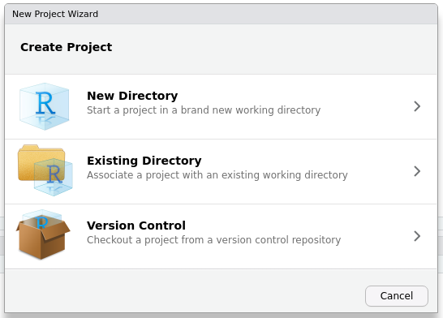
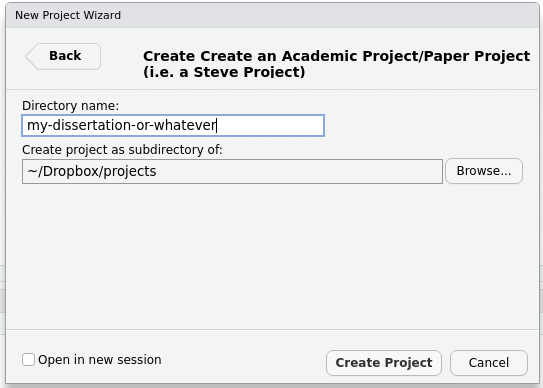

# Steve’s Academic R Projects

[](https://cran.r-project.org/package=steveproj)
[](https://cran.r-project.org/package=steveproj)
[](https://cran.r-project.org/package=steveproj)
[](https://cran.r-project.org/package=steveproj)


`{steveproj}` is an R package to help you start and manage R projects
with an eye toward producing an academic project (to culminate in an
academic paper). The package is in development and will incorporate
other packages in my eponymous R ecosystem, prominently
[`{stevetemplates}`](https://github.com/svmiller/stevetemplates). The
package itself leans primarily on Rstudio and how it creates/manages
projects. The creation a project in Rstudio, through `{steveproj}`, will
result in a new directory containing subdirectories for rendering
documents (`src`), R scripts for analysis (`R`), finished data objects
(`data`), and finished reports (`doc`). An accompanying `Makefile` and R
Markdown file will assist in the management and production of the
project.

## Installation

When the time comes, you can install this on CRAN.

``` r
install.packages("steveproj")
```

Right now, this package in development and is not available on CRAN. You
can install the development version of `steveproj` from Github via the
`devtools` package. I suppose using the `remotes` package would work as
well.

``` r
devtools::install_github("svmiller/steveproj")
```

## Usage

My website will have a more exhaustive tutorial for using this package
and all that comes in it. For now, a user maximize their experience with
`{steveproj}` through either the console or Rstudio.

### Console

Assume the current working directory is something like
`/home/steve/Dropbox/projects` (as it is for me). Then, a user can
create a new project with the `create_project()` command.

``` r
steveproj::create_project("dissertation")
```

This will create a new directory in the working directory, titled
“dissertation”, that includes a skeleton of a research project to assist
the user in getting started on their academic paper/project. The only
downside to the console approach over the Rstudio approach is the
console approach won’t create an `.Rproj` file in the directory. The
Rstudio approach will.

### Rstudio

Go to *File &gt; New Project*. You’ll see a prompt that looks like this.
Select “New Directory”.



That will direct you here. Scroll down your available project types
until you see my “Steve project” entry. It will have that “S” icon (that
is incidentally the icon for my website). Select it.


That will direct you here. Enter the name of the directory you want to
create. Click “Create Project” when you’re done. This will create a new
directory, titled whatever you entered in the directory name, along with
an `.Rproj` file. By default, it will also open a new Rstudio session.


